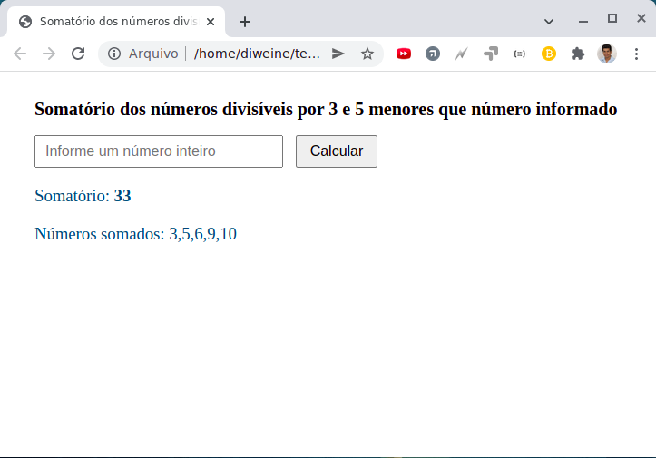

# Projeto para somatório dos números divisíveis por 3 e 5 menores que número informado

O projeto tem o objetivo de implementar uma função que receba um número inteiro positivo e retorne o
somatório de todos os valores inteiros divisíveis por 3 ou 5 que sejam inferiores ao número passado.
 
 

Para executar o teste da função criada basta:
 
1. Baixar o código usando o botão Code, clique na opção Download ZIP.

2. Descompacte o arquivo baixado.

3. Acesse a pasta descompactada.

4. Abra o arquivo index.html no browser de sua preferência.

5. Informe um número inteiro no campo indicado

 

## Tela para teste

 
 

## Tela usando o número 11 como teste

 
 

